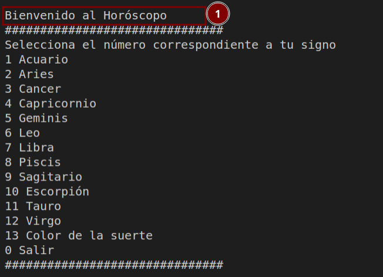
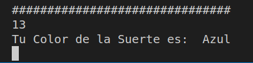

# Prueba módulo 2: Programación básica con Python

En este ejercicio deberá utilizar los conceptos básicos del lenguaje de programación Python para implementar una aplicación de línea de comandos simple. Deberá utilizar tipos de datos primitivos, estructuras de control y lectura de archivos. Además tendrá que utilizar los módulos `random` y `time`

## Instrucciones

### Clonar el repo
El instructor enviará el link para que clonen cada repositorio. Al finalizar la prueba debe commitiar sus cambios y pushear. Puede hacer los commits y push que necesite, no tiene límites de intentos hasta las 11:00 am del día viernes 23 de septiembre del 2022.

### Menú
Crear un menú como en la siguiente imagen:

>Lo indicado en el punto uno de la imagen anterior solo debe aparecer la primera vez que se inicia el programa. No cada vez que se imprime el menú

### Opciones
Al seleccionar una opción válida se debe imprimir en pantalla el contenido del archivo correspondiente y **esperar 3 segundos antes de volver a imprimir el menú**

### Color de la suerte
La opción 13 debe seleccionar aleatoriamente de una lista de al menos seis colores un color y mostrar una salida como la siguiente y volver a esperar 3 segundos antes de imprimir el menú nuevamente:

### Salir
La opción para salir del programa debe ser **0**

### Opción inválida
Si el usuario ingresa una opción incorrecta el programa debe imprimir opción inválida y esperar 3 segundos antes de imprimir nuevamente el Menú

### Indicaciones de código

Todo el código debe ser escrito en inglés y no puede modificar los nombres de los archivos. Todo lo que despliegue el programa hacia el usuario deberá estar escrito en español. El archivo principal de llamará **app.py**

